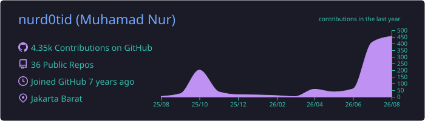
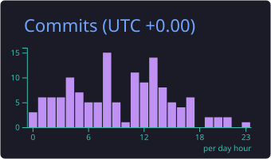

# Muhamad Nur

**Full-Stack Developer** · Jakarta, Indonesia

---

## About

I build **SaaS platforms**, **operational dashboards**, and **cross-platform mobile apps**.  
Work spans the stack: API design, database modeling, infrastructure, and UI.

Currently active on multi-tenant business platforms, career products, and workforce attendance systems.

---

## Stats

  
  
   
  

---

## Stack

  
    
  
  

---

## Activity

  
   
  

